# Ben 10 · Demo v0.8

La demo v0.8 es la única versión jugable de este repositorio. La entrada principal es [index.html](index.html), un archivo autónomo que incluye los sprites de Ben, Cuatro Brazos, Fuego, XLR8, Diamante y Cannonbolt, el escenario, el Omnitrix clásico y el HUD. Se puede jugar sin conexión.

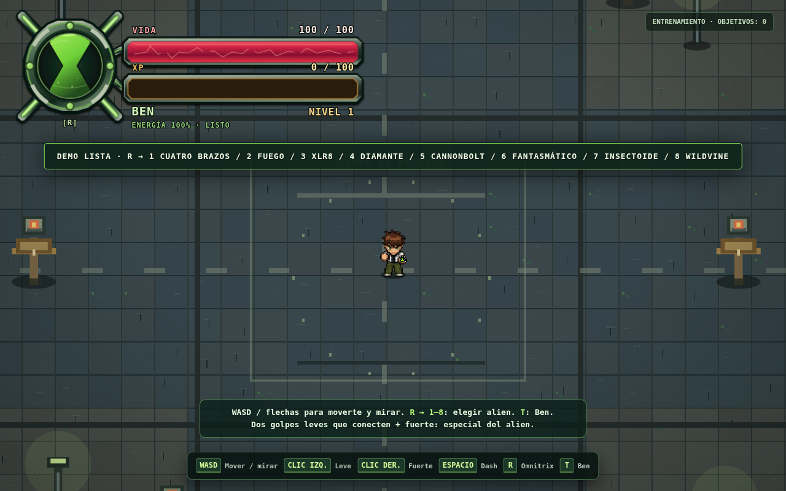

## Sprites HD

Cuatro Brazos, Fuego, XLR8, Diamante y Cannonbolt usan atlas de 160 píxeles de altura base por pose. Las nuevas hojas de referencia mantienen el diseño clásico, las proporciones y el anclaje anatómico; la guardia, el movimiento y los ataques se calibran desde la pose neutra de cada vista. El renderizado conserva el tamaño de los personajes y añade un filtrado de mayor calidad para los contornos.

Los fotogramas se dibujan desde una textura compartida para evitar copiar cientos de imágenes HD al iniciar la demo. El reloj de selección utiliza una escala propia para que los retratos sigan dentro de sus ranuras.

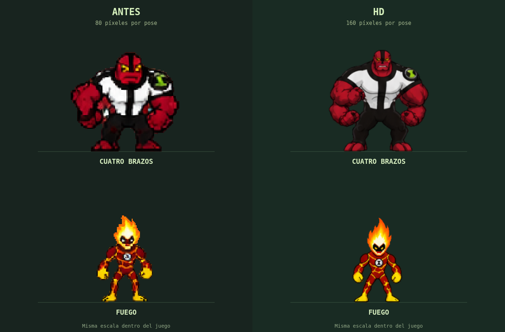

Abre `index.html` en un navegador o inicia el servidor local:

```sh
npm start
```

Visita [http://localhost:8000](http://localhost:8000). Para jugar no hace falta instalar dependencias; el servidor utiliza Python 3.

## Controles

| Acción               | Control        |
| -------------------- | -------------- |
| Moverse y orientarse | WASD o flechas |
| Golpe leve           | Clic izquierdo |
| Golpe fuerte         | Clic derecho   |
| Dash                 | Espacio        |
| Abrir el Omnitrix    | R              |
| Elegir Cuatro Brazos | 1, dentro de la rueda |
| Elegir Fuego         | 2, dentro de la rueda |
| Elegir XLR8          | 3, dentro de la rueda |
| Elegir Diamante      | 4, dentro de la rueda |
| Elegir Cannonbolt    | 5, dentro de la rueda |
| Volver a Ben        | T, o el centro de la rueda |

En pantallas táctiles están disponibles el joystick y los botones. Toca el reloj, elige el retrato del alien y toca el centro de la rueda para volver a Ben. Las otras seis ranuras se reservan para aliens de la serie clásica y están bloqueadas. XLR8 ocupa la ranura 3, Diamante la 4 y Cannonbolt la 5. La rueda incorpora once formas clásicas; las seis siguientes siguen bloqueadas.

## Primer alien: Cuatro Brazos

Cuatro Brazos utiliza sus propios sprites de guardia, marcha, puñetazos alternados, golpes pesados y carga. Sus cuatro brazos y el emblema del Omnitrix en el hombro siguen el diseño clásico. Ben tiene una escala de niño: se redujo su tamaño un 37,5 % respecto a la demo anterior. Cuatro Brazos mide aproximadamente 1,6 veces la altura de Ben; su escala se redujo un 30 % respecto a la primera entrega del alien. La sombra y la colisión acompañan ese tamaño. Camina a 190 unidades por segundo frente a las 247 de Ben; sus golpes tienen más daño y alcance.

La cámara centra el cuerpo completo con un encuadre más cercano, idéntico para Ben y los cinco aliens: transformarse no aleja la vista. Los fotogramas se registran por el centro del torso y el suelo, con margen para los brazos extendidos. Así, las piernas en movimiento no desplazan todo el cuerpo de un lado a otro. Cada ataque incluye preparación, contacto y recuperación hasta la misma guardia; una pulsación rápida queda en espera sin reiniciar el golpe actual. El impacto sísmico conserva la orientación del personaje. Si hace falta espacio para el cuerpo del alien, la transformación busca suelo libre cercano.

El tercer golpe leve dura 0,50 segundos, frente a los 0,38 de los dos primeros. Su smash lateral incluye la pose de puños levantados y sostiene brevemente el impacto para que se lea mejor. El contacto permanece sincronizado con el dibujo y causa daño una sola vez.

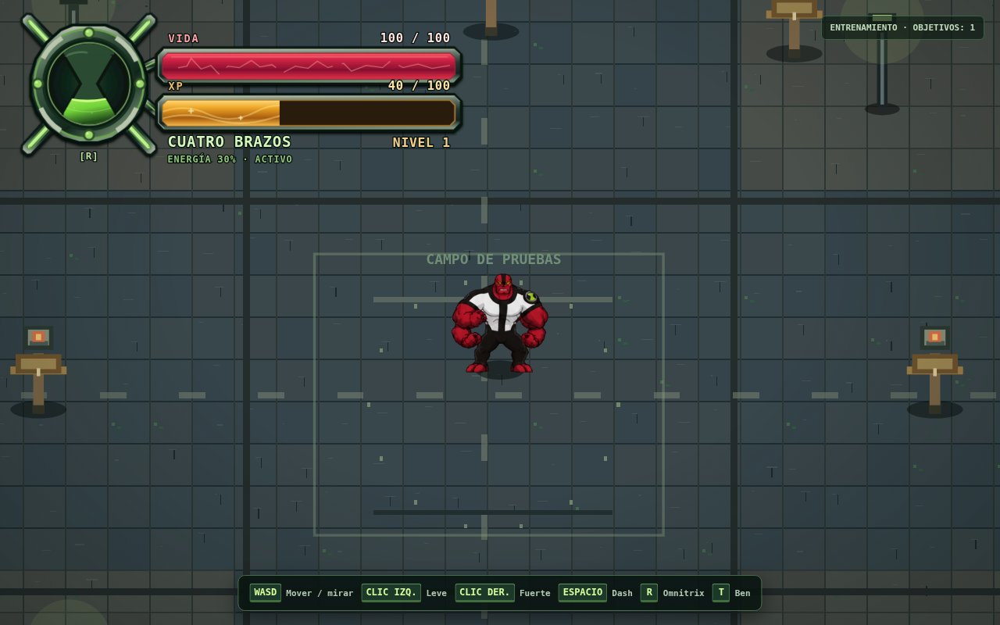

## Fuego clásico y daño de Ben

Fuego tiene 256 fotogramas propios de guardia, carrera, dash y combate en cuatro direcciones. La carrera usa ocho poses de apoyo, compresión, paso y vuelo, con zancadas amplias, brazos opuestos y la llama siguiendo el movimiento. La cadencia acompaña la distancia recorrida y los pies se levantan en las fases de vuelo. Su ciclo ahora tarda aproximadamente un 26 % más en completarse (un 21 % menos de cadencia), conservando la velocidad de 285 unidades por segundo. Su cuerpo de roca roja, las grietas de lava, la cabeza en llamas y el Omnitrix en el pecho siguen el diseño clásico. Es más alto que Ben y más pequeño que Cuatro Brazos, conservando el mismo encuadre.

El combo leve alterna un recto, un gancho con giro de torso y una patada frontal, con tiempos de preparación y recuperación propios. Cada golpe transfiere el peso con un avance corto que respeta las colisiones. Las acciones se registran por la cadera para conservar el giro de hombros. El fuerte alterna un empuje de una palma y una descarga con ambas manos, y lanza una bola de fuego que viaja hasta el objetivo y choca con el escenario. Dos leves conectados preparan una bola explosiva de 70 de daño, con impacto en área y coste de 20 de energía al salir. Cada proyectil impacta una sola vez. Un dash antes del lanzamiento cancela el gasto. Si la energía se agota después de lanzar una bola, esta termina su vuelo mientras Ben vuelve a su forma humana.

La preparación lateral de la descarga utiliza una pose corregida con dos brazos unidos a los hombros. La corrección sustituye únicamente ese fotograma del atlas y conserva su altura y registro.

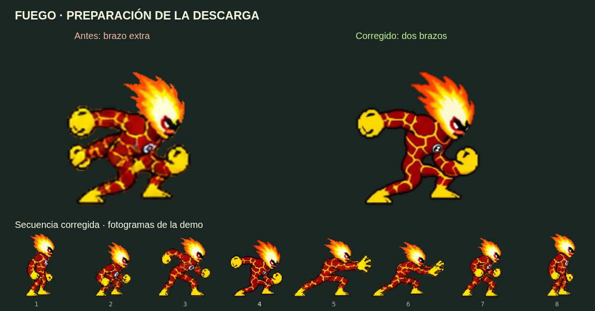

[Ver la descarga corregida y el tercer golpe de Cuatro Brazos](docs/alien-attack-fixes.mp4).

| Personaje | Combo leve | Fuerte | Velocidad |
| --- | --- | --- | --- |
| Ben | 8 / 8 / 12 | 20, cuerpo a cuerpo | 247 |
| Cuatro Brazos | 26 / 30 / 38 | 65, cuerpo a cuerpo | 190 |
| Fuego | 14 / 16 / 20 | 32, bola de fuego | 285 |
| XLR8 | 10 / 12 / 16 | 34, pasada de velocidad | 380 |
| Diamante | 18 / 22 / 28 | 28, lanza de cristal | 230 |
| Cannonbolt | 18 / 22 / 32 | 40–72, embestida cargada | 270, rodando |

Ben hace menos daño que antes: los dos primeros leves bajan de 17 a 8; el tercero, de 25 a 12; el fuerte, de 45 a 20. Fuego tiene un dash más rápido y puede atacar a distancia. Cambiar entre los cinco aliens conserva la vida, el XP y la energía restante.

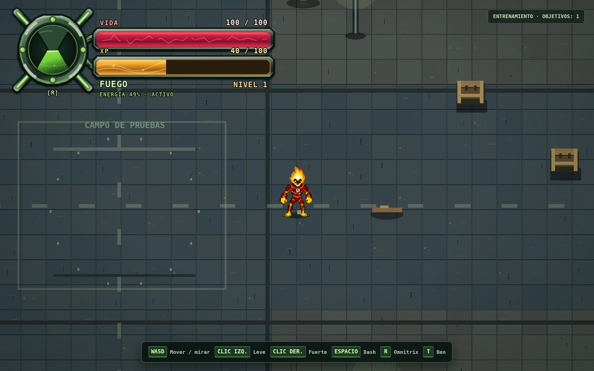

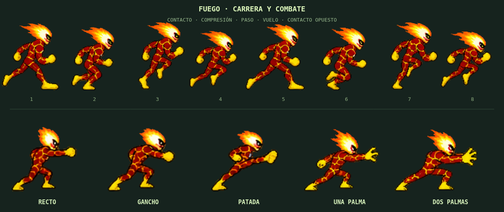

[Ver las animaciones en movimiento](docs/heatblast-motion.mp4).

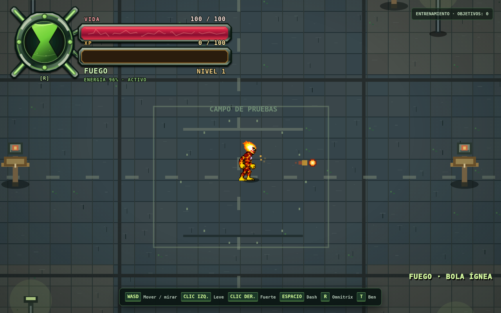

## Diamante clásico

Diamante sigue la referencia de la serie clásica: cuerpo de cristal verde menta con facetas, cabeza angular, ojos amarillos, dos brazos, uniforme blanco y negro y emblema en el pecho izquierdo. Tiene 256 fotogramas originales de guardia, carrera, dash y cinco ataques en cuatro direcciones. Su altura es de 102 unidades, entre Fuego (94) y Cuatro Brazos (112), con el mismo encuadre de cámara.

El combo leve alterna recto, golpe con el otro antebrazo y corte con una cuchilla formada en el brazo. Sus tiempos son de 0,36, 0,40 y 0,62 segundos. La formación de la cuchilla y el impacto se mantienen más de 100 ms cada uno, con una recuperación visible; el daño se aplica una sola vez al contactar. Las animaciones de lanzamiento duran 0,80 segundos. La velocidad de desplazamiento, el vuelo de los proyectiles y el daño se conservan. Cada golpe desplaza el peso 4, 6 o 9 unidades, respeta los obstáculos y tiene una pausa de impacto de 25 ms. Los siguientes golpes pueden ponerse en espera durante la recuperación completa, incluso en la cuchilla y los lanzamientos más largos. La carrera recorre 174 unidades por ciclo completo de ocho poses.

El fuerte alterna dos animaciones de lanzamiento. La lanza de cristal viaja a 600 unidades por segundo e inflige 28 de daño una vez al chocar. Dos leves conectados preparan un estallido de cristales de 72 de daño en un radio de 95 unidades. Cuesta 20 de energía al emitirse, puede cancelarse con dash antes de salir y conserva su daño si Ben revierte durante el vuelo. Los cristales chocan con objetivos, obstáculos y los límites del mapa. Sus destellos y fragmentos se dibujan con facetas verdes propias.

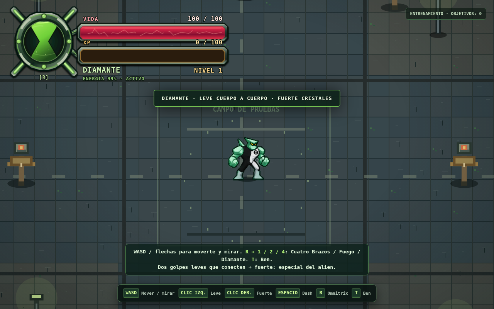

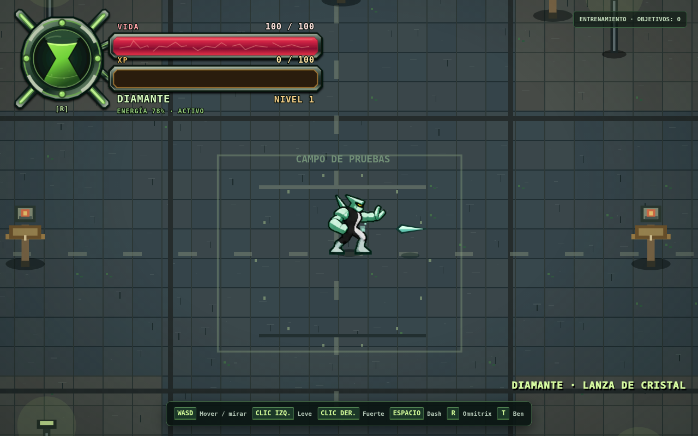

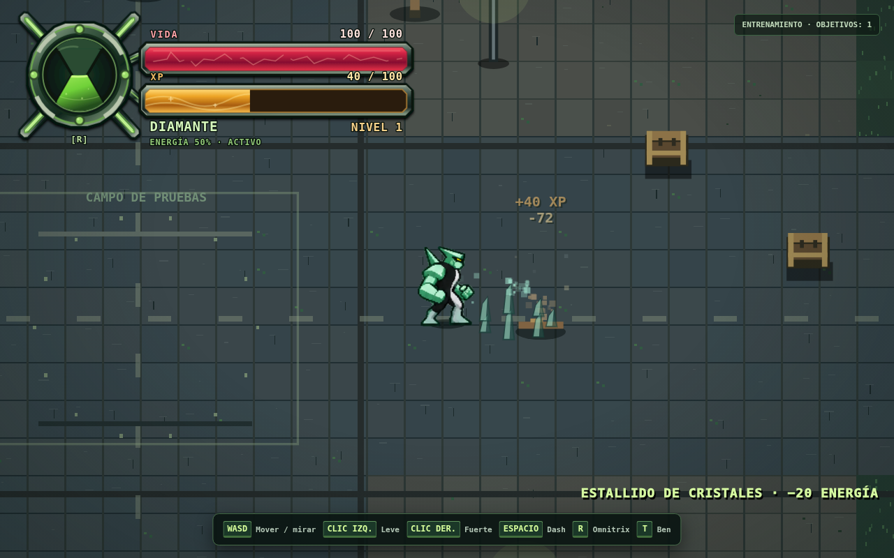

[Ver a Diamante en movimiento](docs/diamondhead.mp4).

## XLR8 clásico y recorrido de velocidad

XLR8 sigue la referencia clásica: cuerpo delgado azul y negro, casco aerodinámico, ojos amarillos, pecho blanco con Omnitrix, cola con franjas y pies con esferas. Sus 256 poses HD cubren guardia, desplazamiento, carrera veloz, tres golpes rápidos, toma de impulso y frenado en cuatro direcciones. Mide 88 unidades y se desplaza a 380 unidades por segundo; la cámara conserva el encuadre y sigue más de cerca la carrera veloz, también en móvil.

- **Clic derecho breve:** sale hasta 180 unidades hacia donde mira y vuelve al punto de partida.
- **Mantener clic derecho:** se agacha para tomar impulso; al superar 0,18 segundos se abre una ventana de 1,6 segundos para dibujar el camino con el ratón. La cámara permanece fija mientras se traza y una línea muestra el recorrido válido. Al terminar la cuenta atrás lo ejecuta automáticamente; soltar antes también lo ejecuta.
- **En móvil:** un toque en `RUTA` hace la ida y vuelta; mantenerlo y arrastrar el dedo dibuja un recorrido.
- **Golpes normales:** alterna un recto, un ataque de garras y una patada rápida de 0,18, 0,20 y 0,26 segundos.

La carrera sigue los puntos dibujados a 1900 unidades por segundo, con un máximo de 1800 unidades de recorrido. Inflige 34 de daño cada vez que cruza a un enemigo. Si sale de su zona de contacto y vuelve a cruzarlo, vuelve a golpear; esto también permite acertar en la ida y en la vuelta del clic breve. La colisión se comprueba a lo largo de cada tramo, así que no se salta objetivos ni atraviesa obstáculos entre fotogramas. Al frenar busca suelo libre si termina sobre un enemigo vivo. El impulso se recupera durante 1,05 segundos después del frenado.

Dos leves conectados y clic derecho activan el combo relámpago: cada pasada de la carrera potenciada hace 58 de daño y, al terminar el recorrido, XLR8 ejecuta una patada de 28 de daño adicionales. Termina la ruta cerca de un enemigo para conectar el remate. La patada dura 0,30 segundos, aplica su daño en el contacto y respeta los obstáculos; el combo completo cuesta 20 de energía. La reserva sobrevive al tiempo de trazado y los 20 puntos de energía se gastan al arrancar. Cancelar con `T`, el reloj, Espacio, un cambio de tamaño de pantalla o pérdida del foco cierra el trazado. Si la energía se agota o Ben revierte durante la carrera, esta se detiene. La reserva no puede reutilizarse después de cancelar o cambiar de forma.

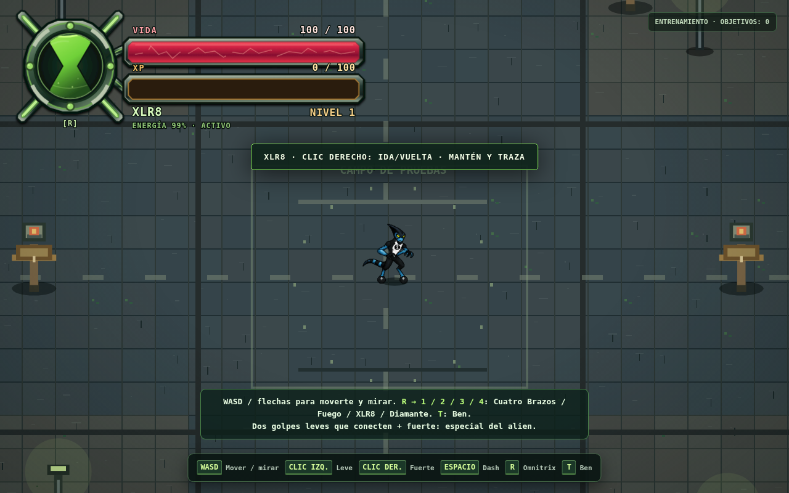

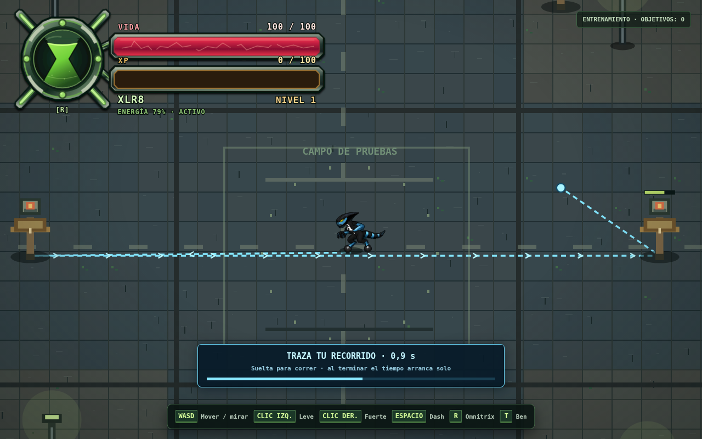

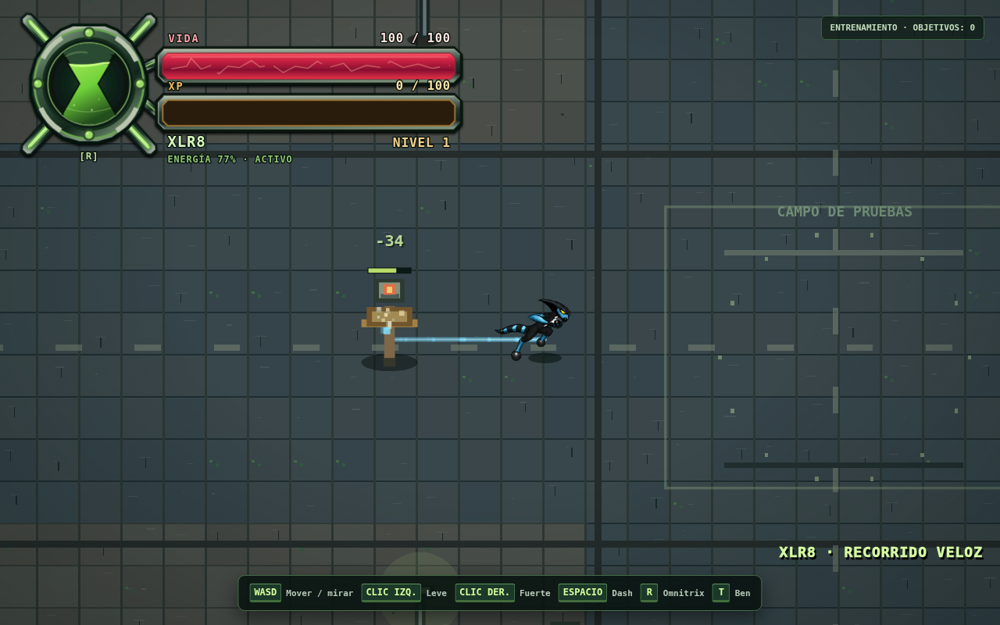

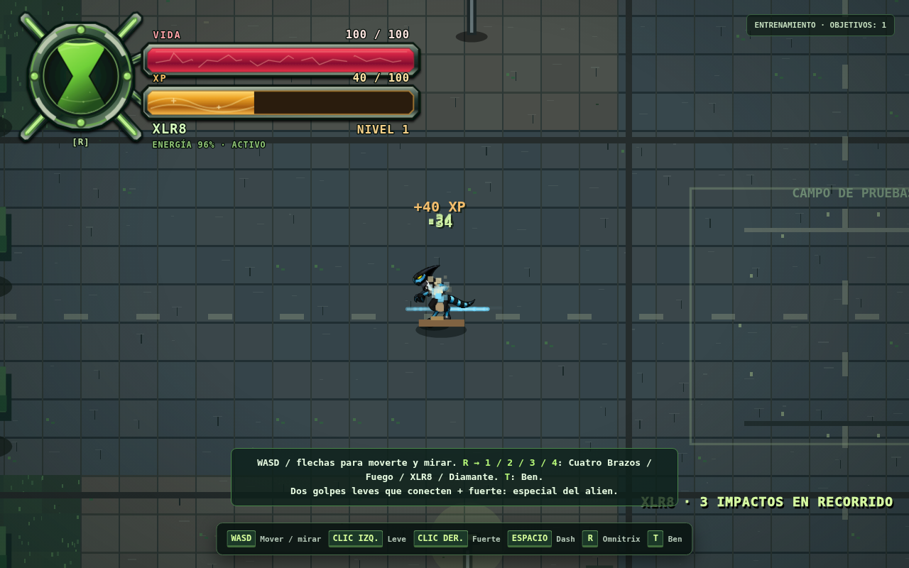

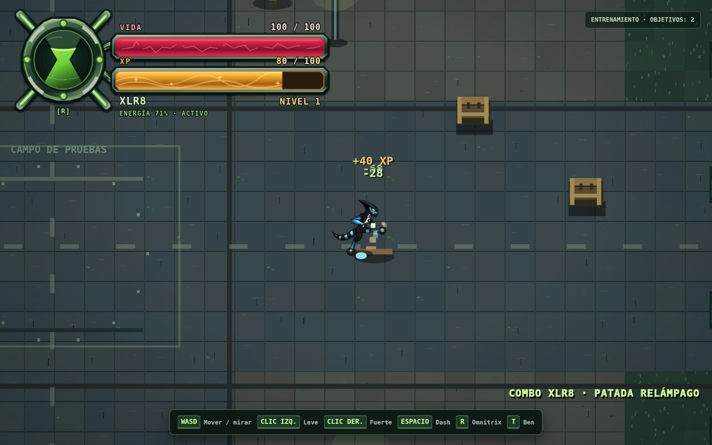

[Ver a XLR8 en movimiento](docs/xlr8.mp4).

## Cannonbolt clásico

Cannonbolt conserva el diseño blanco, negro y amarillo de la referencia, con garras y el Omnitrix en la frente. Tiene 256 poses HD registradas para reposo, cierre, giro de la bola, ambas garras, carga, impacto y apertura en cuatro direcciones. De pie mide 105 unidades; la bola cerrada mide aproximadamente 77, manteniendo el mismo encuadre de cámara. Los extremos del plegado y la apertura comparten la misma esfera para conservar el tamaño.

- **Reposo:** permanece de pie con una animación de guardia.
- **Movimiento:** se cierra en bola y rueda a 270 unidades por segundo; sus paneles giran con la distancia recorrida. Al parar se abre para volver al reposo.
- **Combo leve:** garra izquierda, garra derecha y una embestida corta en bola, con 18, 22 y 32 de daño. Si estaba rodando, se abre antes de usar las garras.
- **Clic derecho:** mantener carga la embestida; soltar la lanza. Un toque breve conserva una preparación mínima de 0,35 segundos. Al llegar a 1,15 segundos sale automáticamente con la fuerza máxima. La carga aumenta de 40 a 72 de daño y de 230 a 460 unidades de alcance.
- **Especial:** dos leves conectados y clic derecho reservan una embestida de ida y vuelta. Hace entre 58 y 90 de daño por pasada, según la carga, y consume 20 de energía al arrancar. Regresa al punto de partida y se abre al detenerse.
- **Espacio:** se cierra y realiza una esquiva rodante sin daño de ataque.

Los impactos se comprueban a lo largo del desplazamiento y respetan los obstáculos con el ancho de su cuerpo. Si termina sobre un enemigo vivo, la recuperación lo deja en suelo libre. Cancelar la carga con `T`, el reloj, Espacio, cambio de tamaño de pantalla o pérdida de foco evita un lanzamiento posterior. Cambiar de forma o quedarse sin energía detiene la embestida. El botón táctil `CARGA` admite mantener y soltar.

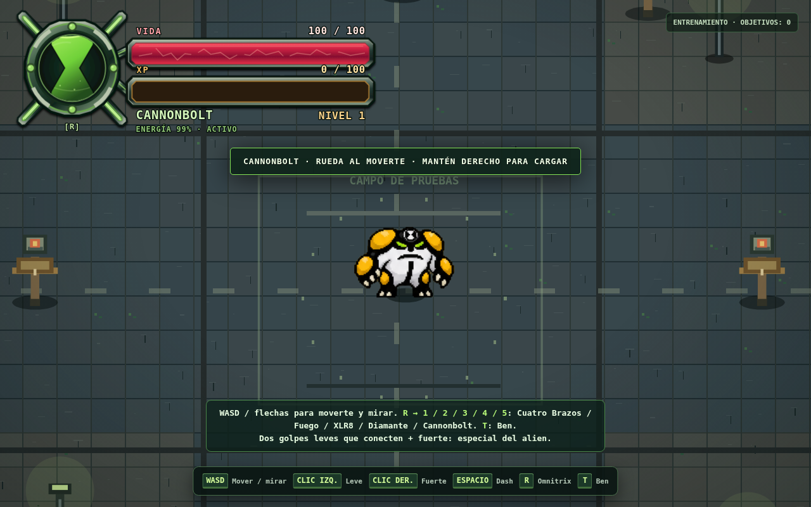

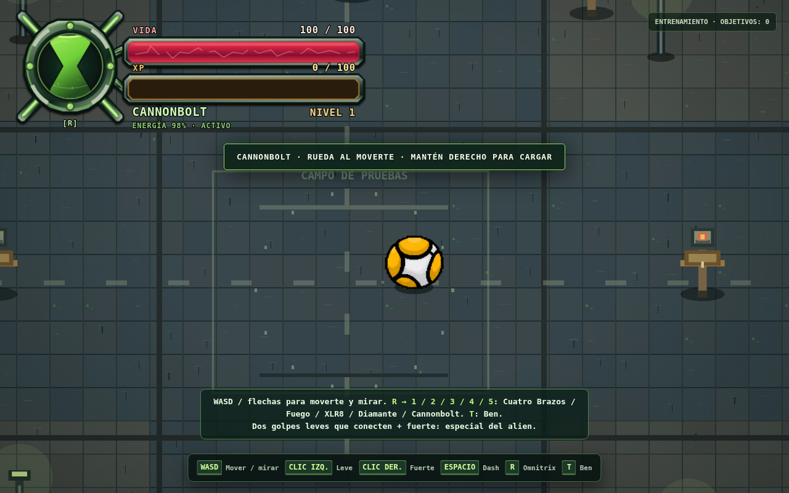

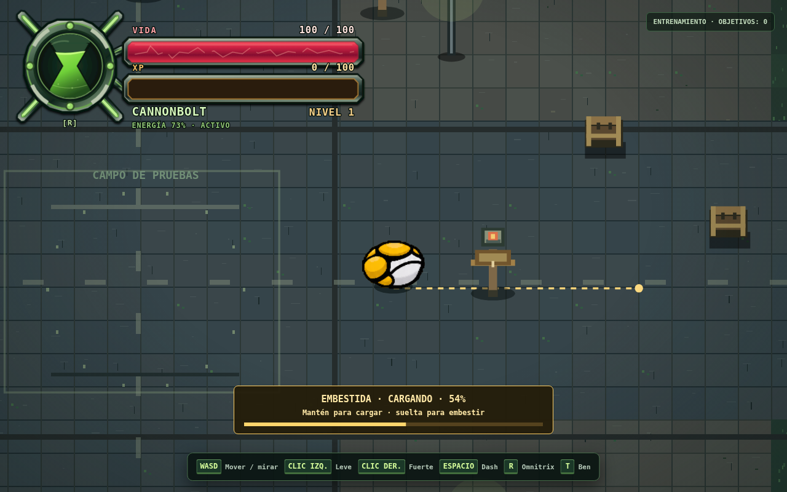

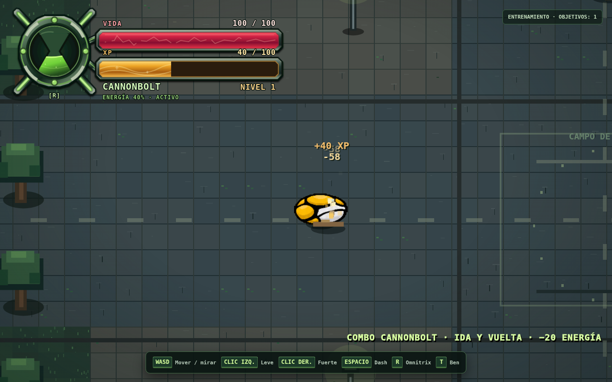

[Ver a Cannonbolt en movimiento](docs/cannonbolt.mp4).

## HUD y progresión

- El líquido verde del reloj representa la energía del Omnitrix. El propio reloj abre la rueda de selección.
- La barra roja muestra la vida; la naranja muestra el XP necesario para el siguiente nivel.
- Cada objetivo derrotado otorga 40 XP. El primer nivel requiere 100 XP y cada siguiente umbral aumenta en 50. El sobrante se conserva al subir de nivel.

Cada alien consume 1,5 puntos de energía por segundo. Dos leves conectados y un fuerte activan un especial de 20 puntos: impacto sísmico con Cuatro Brazos, bola ígnea explosiva con Fuego, estallido de cristales con Diamante, carrera potenciada con XLR8 o embestida de ida y vuelta con Cannonbolt. El gasto ocurre al salir el especial, incluso si falla; cancelar la animación con un dash antes del contacto evita el gasto.

Al agotarse la energía, el sistema vuelve a Ben conservando vida, XP y nivel. En forma humana, el reloj comienza a recargarse tras 3 segundos, a 8 puntos por segundo. La rueda pausa la simulación. El XP y el nivel se mantienen durante la sesión; recargar la página inicia una sesión nueva.

## Desarrollo

```sh
npm ci
npx playwright install chromium
npm test
```

Las 214 comprobaciones verifican los fotogramas, la guardia, los golpes, el dash, el anclaje del reloj, la energía, los especiales, el XP y el HUD en escritorio y móvil. También prueban la transformación real a Cuatro Brazos y a Fuego, sus cuatro direcciones de ataque, las escalas, su colisión, la cámara fija, la estabilidad del torso, la recuperación de los golpes, los combos con pulsaciones rápidas y la vuelta a Ben por teclado, por pantalla táctil y por energía agotada. Las pruebas de fuego verifican el daño reducido de Ben, los ataques cuerpo a cuerpo, el vuelo de los proyectiles, los obstáculos, las explosiones y las colisiones a distintas tasas de actualización. También comprueban la variación real de las siluetas al correr, la cadencia según la distancia, los cinco ataques distintos, la sincronización del contacto y los avances de los golpes a 30, 60 y 120 actualizaciones por segundo. Las comprobaciones HD verifican la resolución de los atlas, el tamaño físico de ambos aliens, la representación en pantallas normales y retina y la cadencia reducida de Fuego sin alterar su desplazamiento. Las pruebas de Diamante comprueban la selección de la ranura 4 por teclado y pantalla táctil, sus 256 poses, el movimiento y los golpes en cuatro direcciones, los avances de peso, las pulsaciones en espera, los proyectiles y su estallido, el gasto de energía, la conservación de estadísticas y la vuelta a Ben. Las pruebas de XLR8 verifican sus poses, golpes rápidos, clic breve, trazo por ratón y dedo, temporizador automático, cámara en móvil, coordenadas retina, colisiones continuas, cancelaciones, enfriamiento, reserva del especial y retorno a Ben. El movimiento y el daño del recorrido se comprueban a 30, 60 y 120 actualizaciones por segundo. Las pruebas de Cannonbolt verifican la rueda ampliada, las transiciones de cuerpo a esfera, el diámetro estable, los ataques de garra y la tercera embestida en cuatro direcciones, la carga por ratón y pantalla táctil, el combo de ida y vuelta, el gasto único de energía, las cancelaciones y las colisiones de la esfera. El tercer golpe de Cuatro Brazos se comprueba con sus nuevos tiempos, su daño único y la siguiente pulsación en espera a 30, 60 y 120 actualizaciones por segundo. Si Chromium está instalado en `/usr/bin/chromium`, se utiliza ese ejecutable; también puede indicarse otro mediante `CHROMIUM_PATH`.

El diseño fuente y el atlas del reloj están en [assets](assets). Para recompilarlo e incrustarlo en `index.html`:

```sh
npm run build:omnitrix
```

El modelo de vida, energía y XP está en [systems/player-stats.js](systems/player-stats.js). Después de modificarlo, este comando sincroniza su copia incrustada en el HTML:

```sh
npm run build:stats
```

`tests` contiene únicamente las pruebas de esta demo. `docs/preview.png` muestra el HUD actual.

Las fuentes de Cuatro Brazos y su atlas están en [assets/aliens](assets/aliens). Este comando vuelve a registrar los fotogramas con el torso centrado y una línea de suelo común, conserva los brazos completos e incrusta el atlas en el único HTML jugable:

```sh
npm run build:four-arms
```

Las fuentes y el atlas de Fuego están en la misma carpeta. La guardia se registra por el pecho y las acciones nuevas por la cadera, con un suelo común y margen para las llamas, brazos y piernas extendidos:

```sh
npm run build:heatblast
```

Las fuentes y el atlas de Diamante se compilan e incrustan con:

```sh
npm run build:diamondhead
```

La trayectoria y las colisiones de las bolas de fuego y las lanzas de cristal se prueban en [systems/fire-projectiles.js](systems/fire-projectiles.js). Para sincronizar su copia incrustada:

```sh
npm run build:fire
```

Las fuentes y el atlas de XLR8 se registran por la cadera, conservando margen para la cola, con:

```sh
npm run build:xlr8
```

La física de los recorridos está en [systems/speed-route.js](systems/speed-route.js) y los controles y efectos en [systems/xlr8-game.js](systems/xlr8-game.js). Para sincronizar ambas copias en el HTML:

```sh
npm run build:speed
```

Las fuentes de Cannonbolt se compilan e incrustan con:

```sh
npm run build:cannonbolt
```

La carga y las embestidas se prueban en [systems/cannonbolt-physics.js](systems/cannonbolt-physics.js), y sus controles y transiciones están en [systems/cannonbolt-game.js](systems/cannonbolt-game.js). Para sincronizarlos con el HTML:

```sh
npm run build:cannon
```

Los compiladores comprimen los atlas PNG sin modificar sus píxeles para reducir el tamaño del archivo autónomo.
